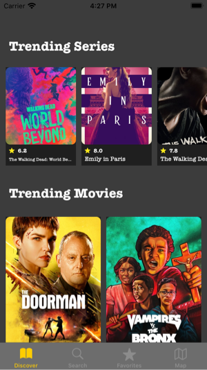
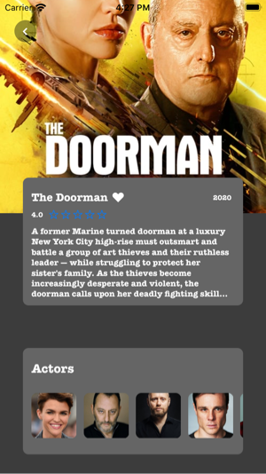
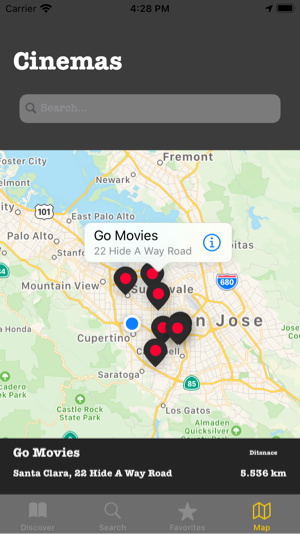

# MovieMe
> MovieMe is an app that pulls the top movies and tv shows and displays it using a modern UI.

## Table of contents
* [General info](#general-info)
* [Screenshots](#screenshots)
* [Setup](#Setup)
* [Technologies](#technologies)
* [Features](#features)
* [Status](#status)
* [Contact](#contact)

## General info

MovieMe is an app that pulls the top 20 movies from TheMovieDB API and displays it using a modern UI.
Main features include :

Showing the top 20 movies and tv shows dynamically on a card layout
Ability to search within the whole TMDb API
Ability to save movies to favorites
Ability to delete movies from the favorites list
Ability to get nearby movie theaters
And more

APIs used:
* TMDb API [@TMDb](https://developers.themoviedb.org/3)
* Foursquare API [@Foursquare](http://developer.foursquare.com)
* Map Quest API [@MapQuest](http://www.mapquestapi.com)

## Setup

1. [Grab media data key](https://developers.themoviedb.org/3)

2. [Grab movie theaters key](http://developer.foursquare.com)

3. [Grab cities geocoding key](http://www.mapquestapi.com)

4. Get your files into the Constant project

5. Run the app

## Screenshots

## Technologies
* Xcode - version 11.6
* Swift
* UIKit 
* UICollectionView
* Custom CollectionViewCell
* Realm
* Networking
* Public APIs
* JSON Parsing using codable
* Custom UIViews
* UIMapKit
* Kingfisher

## Features
List of features ready and TODOs for future development:
* Search for top Movies and Tv shows
* Save top Movies and Tv shows to favourites
* Delete saved Movies and Tv shows from favourites
* Search for near movie theaters
* Offline Mode
* And more...

To-do list:
* Improve distance from chosen point to the closest movieTheaters
* Improve UIAlerts design for error handling

## Status
Project is: _finished_

## Contact
Created by @meitarbasson - feel free to contact me!
